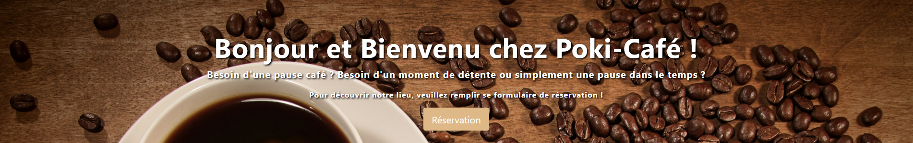

# Le Poki-café

## Mission

Réalise le site vitrine d'une franchise de restaurants. La franchise est fictive mais le type de nourriture (burger, pizza, asiatique,...) est laissé au choix de l’apprenant.

Minimum 5 pages accessibles par une barre de navigation (navbar) présente sur toutes les pages et menant aux différentes rubriques : Accueil, Carte, Photos, Restaurants, Contact.

Si tu souhaites faire un site plus complet avec encore plus de trucs, fais-toi plaisir !

## Composition du site
Il faut au minimum :

- Une page **Accueil** avec un composant Jumbotron et deux panneaux (panel) pour afficher des news (genre promotions, news ou évènements de la semaine)
- Une page **Carte** avec les menus présentés sous forme de liste groupée avec badges
- Une page **Photos** avec une galerie photos (minimum 10) et une pagination (3 photos par page)
- Une page **Restaurants** avec l'adresse, un plan d'accès et les heures d'ouverture d’au moins deux restaurants (c’est une franchise !)
- Une page **Contact** avec un formulaire de contact comprenant nom, prénom, e-mail, liste déroulante (objet du message avec un select et des options), un champs de texte (pour le message), un bouton d'envoi avec [glyphicon](http://glyphicons.com/). Les intitulés des champs sont dans la balise sémantique adéquate.

## Languages utilisé ?

HTML5 et SASS (CSS3) et Javascript

## Durée ?

Débuter le 17/05/2019 et non terminé

## Aperçu :

Cliquer ici pour un aperçu du site : [Poki-Café](https://lesly1994.github.io/Poki-Cafe/ )